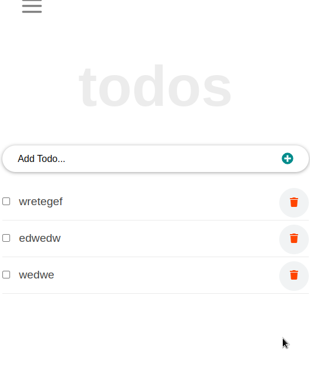

# To Do List - React Js

"To Do List" is an exercise for Micoverse student learning React Js.

### project spashoots

##### For validation detection using Webhint Run

npx hint .

## Available Scripts

In the project directory, you can run:

### `npm install` and `npm start`
once you have cloned the repo

## Author

👤 **Gordon Otieno**

- GitHub: [@gordonotieno](https://github.com/gordonotieno)
- LinkedIn: [gordonOtieno](https://www.linkedin.com/in/gordon-otieno-612b98184/)

## 🤝 Contributing

Contributions, issues, and feature requests are welcome!

Feel free to check the [issues page](https://github.com/GordonOtieno/react-todo-app/issues).

## Show your support

Give a ⭐️ if you like this project!

## Acknowledgments

-This project was inspired by [Microverse](https://www.microverse.org)

